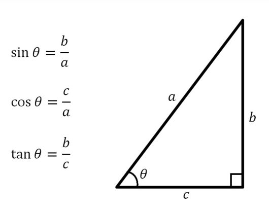

# 도(Degree), 라디안(Radian)

## 도(Degree)

* 1회전을 360등분으로 나눈 단위이다.

* 기호로는 **°**(도 기호)를 사용한다. 이를 육십분법이라고 한다.

## 라디안(Radian)

{:.aligncenter}

* 각의 크기를 재는 SI 단위이다. 

* 기호로는 rad(라디안)을 사용한다. 이를 호도법이라고 한다.

* 부채꼴에서 호의 길이를 l, 반지름의 길이를 r이라고 하면 중심각의 크기 θ는 로 정의한다.

* 호의 길이가 반지름의 길이와 같을 때 그 중심각의 크기는 1 rad이다. (1 rad는 약 57.2958°이다.)

  

### 호도법

* 라디안을 단위로 하여 각도를 나타내는 방법이다.
* 원주율 π가 원의 둘레를 지름으로 나눈 값이므로, π rad는 180°이다.

| 육십분법 |  0°  | 30°  | 45°  | 60°  | 90°  | 180° | 270° | 360° |
| -------- | :--: | :--: | :--: | :--: | :--: | :--: | :--: | :--: |
| 호도법   |  0   | π/6  | π/4  | π/3  | π/2  |  π   | 3/2π |  2π  |

## 도에서 라디안, 라디안에서 도

* 1°는 라디안으로 π/180이고, 1 rad는 도 단위로 π/180이다.
* 120°를 라디안으로 변환하면 120 * ( π/180) = 2π/3이다.
* 4π/3를 도 단위로 변환하면 (4π/3) * (180/π) = 240°이다.

# 삼각함수

* 각의 크기를 삼각비로 나타내는 함수이다.

* 삼각함수에는 3개의 기본적인 함수가 있으며, 이들을 **사인**(sine, 기호 sin) · **코사인**(cosine, 기호 cos) · **탄젠트**(tangent, 기호 tan)라고 한다.

* 이들의 역수는 각각 **코시컨트**(cosecant, 기호 csc) · **시컨트**(secant, 기호 sec) · **코탄젠트**(cotangent, 기호 cot)라고 한다.

{:.aligncenter}

## 삼각함수 항등식

## 단위원 항등식

