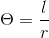
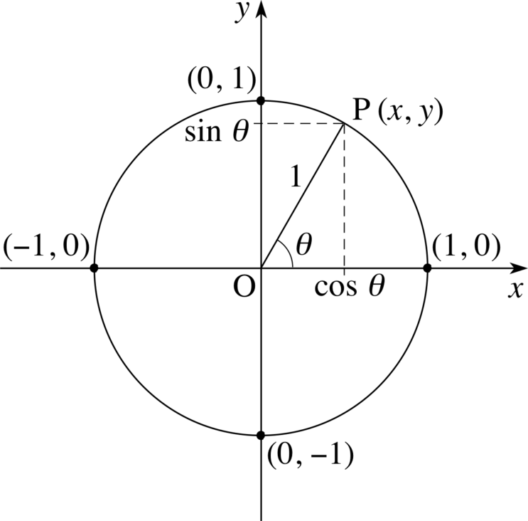

# 도(Degree), 라디안(Radian)

## 도(Degree)

* **1회전**을 **360등분**으로 나눈 단위이다.

* 기호로는 **°**(도 기호)를 사용한다. 이를 **육십분법**이라고 한다.

* ### 라디안(Radian)
  * 라디안
    
  * 각의 크기를 재는 SI 단위이다. 
  * 기호로는 rad(라디안)을 사용한다. 이를 **호도법**이라고 한다.
  * 부채꼴에서 호의 길이를 l, 반지름의 길이를 r이라고 하면 중심각의 크기 θ는 로 정의한다.

  * **호의 길이가 반지름의 길이와 같을 때** 그 **중심각의 크기는 1 rad**이다. (1 rad는 약 57.2958°이다.)

  

* ### 호도법

  
  * **라디안을 단위**로 하여 **각도를 나타내는 방법**이다.
    
  * 원주율 π가 원의 둘레를 지름으로 나눈 값으로 **360° : 2πr = a° : r** 이므로, **π rad**는 **180°**이다.
    
  * | 육십분법 |  0°  | 30°  | 45°  | 60°  | 90°  | 180° | 270° | 360° |
      | -------- | :--: | :--: | :--: | :--: | :--: | :--: | :--: | :--: |
      | 호도법   |  0   | π/6  | π/4  | π/3  | π/2  |  π   | 3/2π |  2π  |

* ### 도에서 라디안, 라디안에서 도

	* 1°는 라디안으로 π/180이고, 1 rad는 도 단위로 180/π이다.
		* 120°를 라디안으로 변환하면 120 * ( π/180) = 2π/3이다.
		* 4π/3를 도 단위로 변환하면 (4π/3) * (180/π) = 240°이다.

# 삼각함수

* 직각 삼각형에 대한 각의 크기를 **삼각비**로 나타내는 함수이다.

* 삼각함수에는 3개의 기본적인 함수가 있으며, 이들을 **사인**(sine, 기호 sin) · **코사인**(cosine, 기호 cos) · **탄젠트**(tangent, 기호 tan)라고 한다.

* 이들의 역수는 각각 **코시컨트**(cosecant, 기호 csc) · **시컨트**(secant, 기호 sec) · **코탄젠트**(cotangent, 기호 cot)라고 한다.

* 사인 · 코사인 · 탄젠트 공식

  

* **각도를 알고 있을 경우** 사인, 코사인, 탄젠트 함수를 사용한다.
* **각도를 알고자 할 경우** 코시컨트, 시컨트, 코탄젠트를 사용한다.

  

## 삼각함수 항등식

* ### 단위원 항등식

	* 단위원
	
	* 단위원은 **중심이 원점**이고 **반지름의 길이가 1인 원**으로 **단위원의 방정식은 x^2 + y^2 = 1**이다.
	* 임의의 점 P를 통해 **빗변의 길이가 반지름의 길이**인 **직각삼각형**을 그릴 수 있다.
	* P(x, y)는 **사인과 코사인 정의**에 의해 cosθ = x/1, sinθ = y/1이 된다. 따라서 **x = cosθ, y = sinθ**이다.
	* 단위원을 사용하면 **사인과 코사인 값**을 **90°의 배수에 대해 쉽게 기억**할 수 있다.
	  * 90°에서 단위원 위의 점의 좌표가 (0, 1)이 므로,  **cos90° = 0, sin90° = 1**이 된다.
	* 단위원의 방정식 x,y 대신에 사인과 코사인 항으로 치환하면 **단위원 항등식은 cos^2θ + sin^2θ = 1**인 것을 알 수 있다.