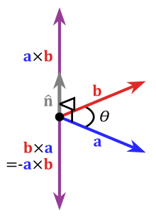

# 벡터(Vector)

* 벡터는 **방향을 포함한 크기의 값**이다.

* 벡터의 **시작 부분을 시작점**, 벡터의 **화살표 촉 부분을 끝점**이라 한다.

* **방향과 크기가 같다면** 어느 좌표로 이동하여도 **같은 벡터**이다.

  

## 벡터의 덧셈

* 벡터의 덧셈은 **벡터를 하나씩 더한 것**과 같다.

* 벡터의 덧셈 방법.png)

> **벡터 합의 교환법칙**
>
> 임의의 벡터 A, B에 대하여, **A+B = B+A**

## 벡터의 뺄셈

* 벡터의 뺄셈은 **빼는 벡터의 방향을 바꿔서 더한 것**과 같다.

* 2 - 3 = -1인 것을 2 + (-3) = -1로 바꾼다고 생각하면 이해가 쉽다.

* 벡터의 뺄셈 방법.png)

* **벡터 AB**에서 **벡터 AC를** 빼면 **C에서 B를 가리키는 벡터**를 알 수 있고, (AB - AC = CB)

* **벡터 AC**에서 **벡터 AB**를 빼면 **B에서 C를 가리키는 벡터**를 알 수 있다. (AC - AB = BC)

## 벡터의 스칼라 곱

* 벡터에 스칼라를 곱하는 것은 **벡터의 크기를 늘리거나 줄이는 결과**를 가져온다.

* 곱하는 스칼라가 1보다 크다면, 벡터의 크기는 커지고, 스칼라가 1보다 작다면, 벡터의 크기는 작아진다.

## 정규화(Normalization)와 단위벡터

* ### 정규화(Normalization)

	* 벡터의 **크기를 1로 맞추는 것**을 의미한다.
	* 벡터를 **단위벡터로 변환할 때 사용**한다.

* ### 단위벡터

	* 크기와 상관없이 **방향을 정의하는 벡터**이다.
	* **벡터의 정규화**를 통해 만들어진다.

* ### 벡터의 정규화(단위 벡터 구하기)

	1. 임의의 **벡터의 x, y 좌표**를 **피타고라스 정리**를 이용해 **벡터의 길이를 구한다**.
	2. **벡터의 길이로 각 좌표를 나눠주면** 벡터에 대한 **단위벡터**가 된다.

* ### 단위벡터 활용

	* **단위벡터와 스칼라 곱을 이용**하여 **임의의 벡터 A에서 B까지의 이동**을 구현할 수 있다.

## 벡터의 내적(Dot Product)

* ### 벡터의 내적 계산법

	* Scalar Product (스칼라 곱) 또는 Dot Product라고 부른다.

	* 벡터의 내적을 계산할 때는 •(dot) 기호를 사용한다.

	* 벡터의 내적의 계산은 두 가지 방법이 있다.

	* 내적은 보통 **단위벡터와 사용**된다.

  

	* #### 첫 번째 방법 : 좌표 값의 각 성분을 곱해서 더하는 방법
	
	  > 임의의 2차원 벡터 A[x1, y1], B[x2, y2]에 대하여,
	  >
	  > A•B = x1x2 + y1y2
	  >
	  > ※ 3차원 벡터는 z를 추가하여 계산
	
	  * 내적에 대한 **결과 값**은 항상 **스칼라 값**이다.
	  * **A•B = 0** 이면, **A와 B는 직교**한다.
	  * 두 벡터 A와 B사이의 각을 θ라 할 때,
	    * **A•B < 0** 이면 (즉, 음수이면) **θ > 90°**
	    * **A•B > 0** 이면 (즉, 양수이면) **θ < 90**°
	
	
	
	* #### 두 번째 방법 : 벡터의 크기를 곱한다.
	
	  > 임의의 두 벡터 A, B사이의 각을 θ라 할 때,
	  >
	  > A•B = |A| * |B| * cosθ
	  * 첫 번째 방법을 통해 **벡터의 내적을 계산**한다. A•B
	  * **벡터의 크기**를 **왼쪽으로 이항**시킨다. A•B / (|A| * |B|)
	  * A•B / (|A| * |B|) = cosθ 이므로, 두 벡터의 사이 각을 구할 수 있다.
	  * 내적 공식에 **단위벡터의 크기를 대입**하면 A•B = 1 * 1 * cosθ이므로 **A•B = cosθ**임을 알 수 있다.

* ### 벡터의 내적의 활용

	* 빛이나 컬링, 충돌 등의 계산에서 활용한다.

## 벡터의 외적(Outer Product)

* ### 벡터의 외적 계산법

	* Cross Product 또는  벡터적이라고 한다.
	* 벡터의 외적을 계산할 때는 ×(cross) 기호를 사용한다.
	* 내적과 달리 외적은 3차원에서만 의미를 가진다.
		
	>임의의 두 벡터 A[x1, y1, z1], B[x2, y2, z2]에 대하여,
	>
	>A×B = [(y1z2 - z1y2), (z1x2 - x1z2) (x1y2 - y1x2)]
	
	
	
	
	* 외적의 결과는 **두 벡터와 모두 직교하는 벡터**이다.
	* 이러한 이유 때문에 외적은 3차원 벡터에 대해서만 정의된다.
	* 외적의 결과는 **단위 벡터**인 임의의 **두 벡터의 사이 각**이다.
	> 임의의 두 3차원 벡터 A, B에 대하여,
	> 
	> |A×B|=|A| * |B| * sinθ
	> 
	> **※ 각을 구하는 데에는 외적보다 내적이 연산 속도가 더 빠르다.**
	
	
	
	
	* 오른손 좌표계를 통한 외적
	   

## 법선 벡터(Normal Vector)

* 법선 벡터란 **주어진 면에 수직인 길이가 1인 벡터**이다.
* 보통 **정규화**해서 사용한다.
* 법선 벡터 = A×B / |A×B|

* ### 법선 벡터의 활용
  * 두 벡터를 포함한 평면이 바라보는 방향을 찾는 등의 계산에서 활용한다.